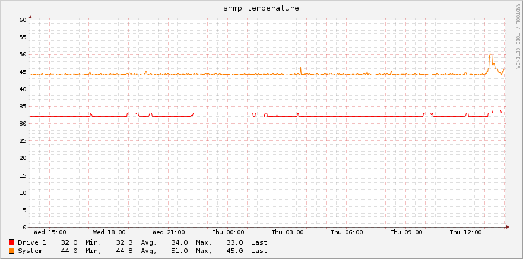
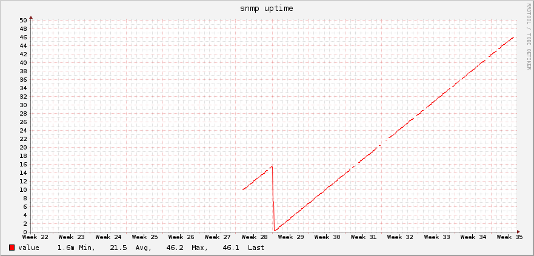

# Synology DSM profile for collectd


This repository is intended for anyone who wants to monitor a Synology NAS
using SNMP protocol and a lightweight [collectd](https://collectd.org) tool.

If you have any ideas on how to improve this repository, you are welcome
to create an issue or pull request.

## Requirements

Collectd SNMP features relies on the Net-SNMP library as described [here](https://collectd.org/wiki/index.php/Plugin:SNMP). You therefore need to have this library installed.
This is done by executing e.g. `apt-get install snmp`.

To use the plugin with Synology DSM you need to
download and place the DSM management information base (MIB) files.
Standard location for those files is `/usr/share/snmp/mibs`. The required files
are:

* **SNMPv2-MIB.mib**
* **SNMPv2-SMI.mib**
* **SNMPv2-TC.mib**

and all the Synology MIBs that are available to download on the link provided
in this official 🔗[documentation PDF](https://global.download.synology.com/download/Document/MIBGuide/Synology_DiskStation_MIB_Guide.pdf).

## Instalation

Just clone this repository somewhere on your system and symlink the `dsm-snmp.conf`
file to the `/etc/collectd/collectd.conf.d/` directory. You can of course move
the file to the location, but by symlinking you'll get free updates by `git pull`.

> A note to updating
> 
> Although it is a great thing to have the "profile" always updated. It might
> be dangerous to blindly pull all the changes automatically. Some old collected
> data can be malformed by changing their definition.

## Usage

In the snmp plugin configuration section add the host and specify what information
you want to collect. E.g.

```
<Host "synology.example.com">
	Address "192.168.1.2"
	Version 2
	Community "local"
	Collect "dsm.uptime"
	Collect "dsm.services"
	...
</Host>
```

Other configuration options for this section are described in `collectd-snmp(5)`.

## Available data sets

Those data sets can be specified as an parameter to the `Collect` key in *Host* config section.

### Disk temperature 🌡 

A temperature for all available disks installed in NAS.

```
Collect "dsm.diskTemperature"
```



### Disk utilization 💾

An amout of bytes read/written to each device.

```
Collect "dsm.diskUtilization"
```

### Disk load ⏳

Short, mid and long term load of each disk.

```
Collect "dsm.diskLoad"
```

### Interface traffic 🚦

A number of bytes transmitted/received on each interface.

```
Collect "dsm.interface"
```

### Interface packets 📦

Similar to **Interface traffic 🚦** but the values are in packets instead of 
bytes.

```
Collect "dsm.interfacePackets"
```

### Services 🤝

The number of users connected using each provided service (HTTP/S, NFS, FTP, CIFS...)

```
Collect "dsm.services"
```

### System load ⏳

Short, mid and long term load of the system. For further information on what is it the load
please see `uptime(1)`, `w(1)`.

```
Collect "dsm.systemLoad"
```

### System temperature 🌡

A temperature of the Synology NAS.

```
Collect "dsm.temperature"
```


### Uptime ⏱

A diskstation uptime. The actual value is in days.

```
Collect "dsm.uptime"
```

> The value is received in milliseconds. The conversion to days is performed by this
> profile by multiplying each received value by 1/(100\*60\*60\*24)
